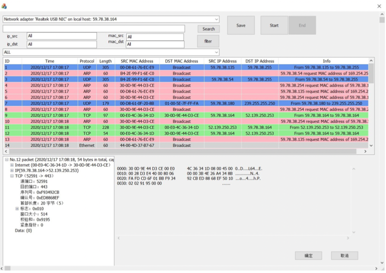
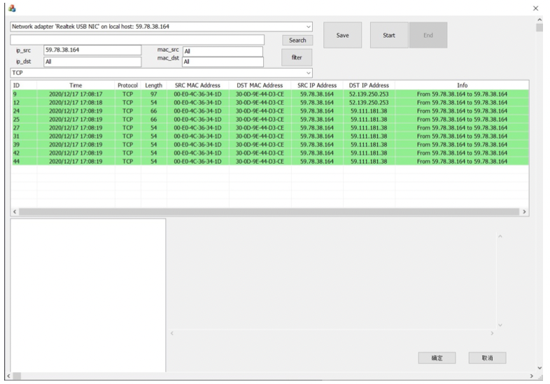

# winSniffer
Homework for IS301, 2020 Fall

# 概述
winSniffer是一个运行于Windows10操作系统下，基于Winpcap4.1.2的抓包软件。使用Visual Studio 2019提供的MFC框架进行构建

# 运行环境
- Windows 10
- Winpcap 4.1.2
- IDE: Visual Studio 2019
- 编译器：MSVC++ 14.22_MSC_VER == 1922

# 功能实现
- [x] 基本功能：通过指定需要监听的网卡，侦听进出本主机的数据包，并解析数据包的内容（ARP、IP、ICMP、IGMP、TCP、UDP、DHCP、HTTP）
- [x] TCP、UDP数据报的全部数据显示
- [x] IP分片重组
- [x] 包过滤：能够侦听指定协议类型的数据包
- [x] 包过滤：能够侦听指定源、目的地址的数据包
- [x] 数据包查询：能够按照一定的查询条件（如数据内容包含“password”）集中显示所有符合条件的数据包
- [x] 数据包保存：能够保存选中的数据包，保存文件具有可读性
- [ ] 文件重组：文件传输过程中，文件会被分割为若干个TCP包传送，如果抓到经本机的全部TCP包，能够将其重组还原为原始文件

# 运行结果：

# 主要算法：
- 调用pcap_findalldevs_ex()查询本机所有网卡
- 调用pcap_open()打开指定网卡并进行监听
- 调用pcap_dump_open()将监听的网卡对应的句柄备份到指定路径
- startCapture函数将创建新的线程根据备份的句柄进行抓包，将抓到的包存入m_pool中进行保存
- stopCapture函数结束抓包过程

# 使用简介：
1. 通过侦听指定需要监听的网卡，侦听进出本主机的数据包，并解析数据包的内容
1. 显示TCP,UDP,ETHERNET,ICMP,IGMP,IP,HTTP,DHCP,ARP数据包内容
1. 包过滤：能够筛选指定协议类型的数据包，能够筛选指定源、目的MAC地址，源、目的IP地址的数据包
1. 数据包查询：输入一定的查询内容，能够显示HTTP MSG和查询内容相同的HTTP数据包
1. 数据包保存：能够保存选中的数据包，保存文件名›为"<时间>_packet.txt"，保存文件具有可读性

# 项目要求
1. 参考WinPcap、SharpPcap、LibPcap等类库
1. 执行Ping、Telnet、浏览网页和传输文件等操作时，Sniffer应返回正确的结果

# 参考资料
1. [WinPcap文档](https://www.winpcap.org/docs/docs_412/html/main.html)
2. [VS2019配置winpcap开发环境](https://www.cnblogs.com/taos/p/12553925.html)
3. [一步步开发sniffer（Winpcap+MFC）](https://blog.csdn.net/litingli/article/details/5950962)
4. [MFC文档](https://docs.microsoft.com/zh-cn/cpp/mfc/mfc-desktop-applications?view=msvc-160)
